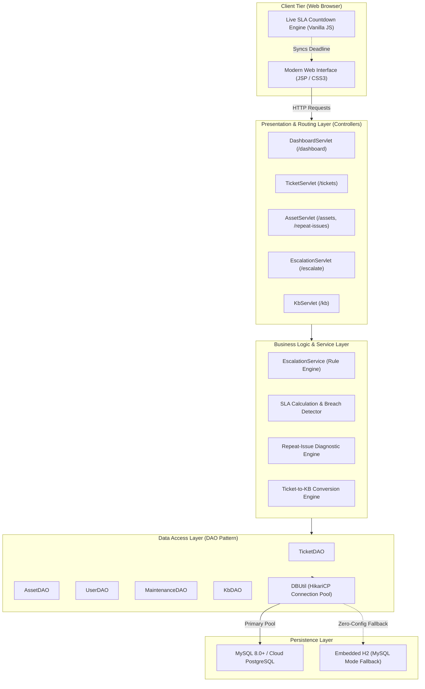
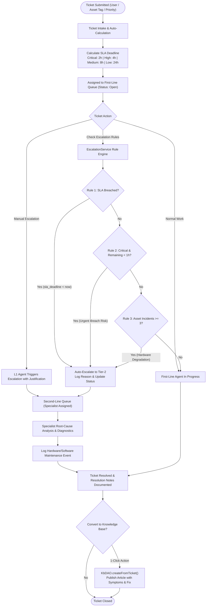

# HelpDesk Lite — Internal IT Ticketing & Asset Tracker

[](https://helpdesk-lites.onrender.com/dashboard)
[](https://openjdk.org/)
[](https://tomcat.apache.org/)
[](https://www.mysql.com/)

### 🌐 Live Production Application
> **Direct Access**: [https://helpdesk-lites.onrender.com/dashboard](https://helpdesk-lites.onrender.com/dashboard)

Enterprise first-line and second-line IT operations workflow system, modelling a real IT helpdesk queue end to end with dynamic SLA countdown timers, multi-rule automated escalation, hardware/software asset allocation, chronic repeat-issue diagnostics, and a one-click Knowledge Base runbook converter.

---

## 🛠️ Tech Stack

| Layer | Technology | Details & Purpose |
| :--- | :--- | :--- |
| **Language & Runtime** | **Java 17 (LTS)** | Core backend language using modern Java syntax, `java.time` API for SLA computation |
| **Servlet Engine** | **Jakarta Servlets 5/6 & JSP** | MVC controller servlets, JSTL templating for server-side dynamic page rendering |
| **Web Server** | **Apache Tomcat 10.1** | Embedded / standalone servlet container executing the Jakarta EE web application |
| **Database Access** | **JDBC & HikariCP** | Raw SQL performance via JDBC with HikariCP high-throughput connection pooling |
| **Databases** | **MySQL 8.0+ / PostgreSQL / H2** | Primary production MySQL/PostgreSQL support with zero-setup embedded H2 fallback |
| **Frontend / UI** | **Vanilla CSS3 & ES6 JS** | Custom IT dark/light design system, real-time client SLA countdown timers |
| **Build System** | **Apache Maven & Wrapper** | Build automation, dependency management, and embedded runner plugins |
| **Logging** | **SLF4J & Logback** | Application diagnostics, database failover tracking, and escalation audit logging |

---

## 🏗️ System Architecture

HelpDesk Lite follows a structured **3-Tier Model-View-Controller (MVC)** design pattern built on Jakarta EE primitives, separating presentation, business logic, and transactional persistence.



---

## 🔄 System Flow Diagram

The following diagram illustrates the end-to-end lifecycle of an IT incident ticket, from intake and dynamic SLA timer calculation to automated Tier-2 escalation, asset repeat-issue correlation, resolution, and Knowledge Base publishing.



---

## 🧠 Backend Logic & Business Rules

### 1. Dynamic SLA Management Engine
Every incident ticket submitted has an automated SLA target assigned based on its business priority:
- **Critical**: 2 Hours
- **High**: 4 Hours
- **Medium**: 8 Hours
- **Low**: 24 Hours

$$\text{sla\_deadline} = \text{created\_at} + \Delta_{\text{SLA}}(\text{priority})$$

- **Server-Side Breach Audit**: Before returning ticket queues, `TicketDAO.checkAndMarkBreaches()` checks open tickets where `sla_deadline < CURRENT_TIMESTAMP` and updates `sla_breached = TRUE`.
- **Client-Side Live Countdown**: The browser executes a JavaScript ticker calculating `Math.floor((deadline - now) / 1000)` every second, dynamically updating status badges:
  - `Normal` (> 2 hours remaining)
  - `Warning` (< 2 hours remaining)
  - `Urgent` (< 1 hour remaining)
  - `Breached` (deadline elapsed)

### 2. Multi-Rule Automated Escalation Engine (`EscalationService`)
The system features an automated rule engine that evaluates active queues to route complex or stalled tickets to Second-Line engineering specialists (`Marcus Vance`, `Elena Rostova`):
- **Rule 1 — SLA Breach Rule**: Automatically escalates any First-Line ticket exceeding its SLA deadline to prevent unresolved bottlenecks.
- **Rule 2 — Critical Proactive Rule**: If a Critical priority ticket has less than 1 hour (< 3,600 seconds) remaining on its SLA timer, it is proactively transferred to Tier-2.
- **Rule 3 — Chronic Asset Failure Rule**: If a ticket is linked to an equipment item with 3 or more logged tickets, it automatically triggers Tier-2 routing for root-cause diagnostic inspection.
- **Audit Logging**: Every escalation automatically writes an immutable log into `escalation_logs` documenting `from_tier`, `to_tier`, `reason`, and `escalated_by`.

### 3. Repeat-Issue Analysis Engine (`AssetDAO`)
HelpDesk Lite detects hardware wear-and-tear and defective software deployments through cross-table subqueries:
- **Incidence Aggregation**: Evaluates all equipment with $\ge 2$ logged incident tickets:
  ```sql
  SELECT a.*, u.name AS assigned_user_name,
         (SELECT COUNT(*) FROM tickets t WHERE t.asset_id = a.id) AS ticket_count,
         (SELECT COUNT(*) FROM tickets t WHERE t.asset_id = a.id AND t.status NOT IN ('Resolved', 'Closed')) AS open_ticket_count,
         (SELECT COUNT(*) FROM maintenance_logs m WHERE m.asset_id = a.id) AS maintenance_count
  FROM assets a
  LEFT JOIN users u ON a.assigned_user_id = u.id
  WHERE (SELECT COUNT(*) FROM tickets t WHERE t.asset_id = a.id) >= 2
  ORDER BY ticket_count DESC, a.id ASC
  ```
- **RMA & Replacement Recommendation**: Pinpoints repeat offenders (e.g., thermal throttling, recurring kernel panics, swollen batteries) and tallies total maintenance repair expenditure.

### 4. Ticket-to-KB Article Transformation Engine (`KbDAO`)
- **1-Click Runbook Publishing**: Solved tickets can be converted into reusable operational guides with a single click.
- **Data Mapping**: Maps `title` $\rightarrow$ Article Title, `description` $\rightarrow$ Observed Symptoms, `resolution_notes` $\rightarrow$ Step-by-Step Resolution Runbook.
- **Knowledge Catalog**: Tracks article view counters and provides keyword search across titles, symptoms, and root causes.

### 5. Resilient Connection Pool & Multi-DB Fallback (`DBUtil`)
- **HikariCP High Performance Pool**: Configures connection limits, timeouts (3000ms), and validation queries.
- **Cloud Auto-Detection**: Auto-parses JDBC URLs or environment variables (`DATABASE_URL`, `MYSQL_URL`, `POSTGRES_URL`, `MYSQL_HOST`, etc.).
- **Zero-Config Embedded Fallback**: If external MySQL or PostgreSQL instances are unavailable, `DBUtil` starts an embedded H2 engine in MySQL mode (`MODE=MySQL;DATABASE_TO_LOWER=TRUE`), automatically executing `schema.sql` and `seed.sql` to ensure continuous availability.

---

## 🗄️ Database Fields Information

### 1. `users` Table
Stores IT support agents (L1/L2) and organizational employees.

| Column Name | Data Type | Constraints | Description |
| :--- | :--- | :--- | :--- |
| `id` | `INT` | PRIMARY KEY, AUTO_INCREMENT | Unique user identifier |
| `name` | `VARCHAR(100)` | NOT NULL | Full name of the user or IT agent |
| `email` | `VARCHAR(100)` | NOT NULL, UNIQUE | Corporate email address |
| `role` | `VARCHAR(50)` | NOT NULL | Role code: `AGENT_L1`, `AGENT_L2`, or `EMPLOYEE` |
| `department` | `VARCHAR(100)` | NULL | Department (e.g., IT Service Desk, Engineering, HR) |
| `created_at` | `TIMESTAMP` | DEFAULT CURRENT_TIMESTAMP | Timestamp when user record was created |

### 2. `assets` Table
Tracks hardware machines, monitors, and enterprise software licenses.

| Column Name | Data Type | Constraints | Description |
| :--- | :--- | :--- | :--- |
| `id` | `INT` | PRIMARY KEY, AUTO_INCREMENT | Unique asset record identifier |
| `asset_tag` | `VARCHAR(50)` | NOT NULL, UNIQUE | Company asset barcode/tag (e.g., `HW-LAP-101`, `SW-LIC-301`) |
| `name` | `VARCHAR(100)` | NOT NULL | Asset display name / model |
| `type` | `VARCHAR(50)` | NOT NULL | Category classification: `Hardware` or `Software` |
| `category` | `VARCHAR(50)` | NOT NULL | Equipment category: `Laptop`, `Monitor`, `License`, `Server` |
| `serial_number`| `VARCHAR(100)` | NULL | Manufacturer serial number or license key ID |
| `purchase_date`| `DATE` | NULL | Procurement date |
| `warranty_expiry` | `DATE` | NULL | Warranty or license subscription renewal date |
| `status` | `VARCHAR(50)` | NOT NULL | Current status: `Allocated`, `In Stock`, `Under Repair`, `Decommissioned` |
| `assigned_user_id` | `INT` | NULL, FK &rarr; `users(id)` | ID of the employee using this asset |
| `specs_or_license` | `TEXT` | NULL | Technical hardware specs or license entitlement details |
| `created_at` | `TIMESTAMP` | DEFAULT CURRENT_TIMESTAMP | Record creation timestamp |

### 3. `tickets` Table
Core IT incident ticketing table tracking tickets, SLA deadlines, and resolution progress.

| Column Name | Data Type | Constraints | Description |
| :--- | :--- | :--- | :--- |
| `id` | `INT` | PRIMARY KEY, AUTO_INCREMENT | Unique internal ticket ID |
| `ticket_number` | `VARCHAR(50)` | NOT NULL, UNIQUE | Human-readable identifier (e.g., `TCK-2026-001`) |
| `title` | `VARCHAR(255)`| NOT NULL | Summary of the reported issue |
| `description` | `TEXT` | NOT NULL | Detailed problem description and symptoms |
| `category` | `VARCHAR(50)` | NOT NULL | `Hardware`, `Software`, `Network`, `Access & Security`, `Infrastructure` |
| `priority` | `VARCHAR(20)` | NOT NULL | Urgency priority: `Critical`, `High`, `Medium`, `Low` |
| `status` | `VARCHAR(50)` | NOT NULL | Status: `Open`, `In Progress`, `Escalated`, `Resolved`, `Closed` |
| `requester_id` | `INT` | NOT NULL, FK &rarr; `users(id)` | ID of user who raised the ticket |
| `assignee_id` | `INT` | NULL, FK &rarr; `users(id)` | ID of the assigned IT engineer |
| `support_tier` | `VARCHAR(20)` | DEFAULT `'First-Line'` | Active handling queue: `First-Line` or `Second-Line` |
| `asset_id` | `INT` | NULL, FK &rarr; `assets(id)` | Linked asset experiencing the issue |
| `sla_deadline` | `TIMESTAMP` | NOT NULL | Computed resolution deadline timestamp |
| `sla_breached` | `BOOLEAN` | DEFAULT `FALSE` | Flag indicating whether deadline has passed |
| `resolution_notes` | `TEXT` | NULL | Technical steps performed to resolve the issue |
| `resolved_at` | `TIMESTAMP` | NULL | Timestamp of ticket resolution |
| `created_at` | `TIMESTAMP` | DEFAULT CURRENT_TIMESTAMP | Timestamp when ticket was submitted |
| `updated_at` | `TIMESTAMP` | DEFAULT CURRENT_TIMESTAMP | Last updated timestamp |

### 4. `maintenance_logs` Table
Maintains servicing logs, repairs, OS re-imaging, and financial maintenance costs.

| Column Name | Data Type | Constraints | Description |
| :--- | :--- | :--- | :--- |
| `id` | `INT` | PRIMARY KEY, AUTO_INCREMENT | Unique log entry identifier |
| `asset_id` | `INT` | NOT NULL, FK &rarr; `assets(id)` | Associated asset identifier |
| `service_type` | `VARCHAR(100)`| NOT NULL | Type: `Installation`, `Driver Fix`, `Battery Replacement`, `OS Reinstall`, etc. |
| `technician_name`| `VARCHAR(100)`| NOT NULL | Name of technician performing maintenance |
| `service_date` | `DATE` | NOT NULL | Date maintenance took place |
| `cost` | `DECIMAL(10,2)`| DEFAULT `0.00` | Incurred repair/servicing cost |
| `notes` | `TEXT` | NULL | Technical notes on diagnosis and parts replaced |
| `created_at` | `TIMESTAMP` | DEFAULT CURRENT_TIMESTAMP | Log entry creation timestamp |

### 5. `escalation_logs` Table
Audit trail tracking tier reassignments from First-Line to Second-Line specialists.

| Column Name | Data Type | Constraints | Description |
| :--- | :--- | :--- | :--- |
| `id` | `INT` | PRIMARY KEY, AUTO_INCREMENT | Unique escalation event identifier |
| `ticket_id` | `INT` | NOT NULL, FK &rarr; `tickets(id)`| Escalated ticket ID |
| `from_tier` | `VARCHAR(20)` | NOT NULL | Source tier (typically `First-Line`) |
| `to_tier` | `VARCHAR(20)` | NOT NULL | Destination tier (typically `Second-Line`) |
| `reason` | `VARCHAR(255)`| NOT NULL | Technical justification or automated rule trigger description |
| `escalated_by`| `VARCHAR(100)`| NOT NULL | Agent name or automated engine identifier (`SLA Rule Engine (Automated)`) |
| `escalated_at`| `TIMESTAMP` | DEFAULT CURRENT_TIMESTAMP | Timestamp of escalation |

### 6. `kb_articles` Table
Stores Knowledge Base runbooks, troubleshooting steps, and verified incident solutions.

| Column Name | Data Type | Constraints | Description |
| :--- | :--- | :--- | :--- |
| `id` | `INT` | PRIMARY KEY, AUTO_INCREMENT | Unique article identifier |
| `title` | `VARCHAR(255)`| NOT NULL | Article title / runbook heading |
| `category` | `VARCHAR(50)` | NOT NULL | Category matching ticket taxonomy |
| `symptoms` | `TEXT` | NOT NULL | Observable symptoms / error description |
| `root_cause` | `TEXT` | NOT NULL | Root-cause analysis |
| `resolution_steps` | `TEXT` | NOT NULL | Step-by-step fix procedures |
| `source_ticket_id` | `INT` | NULL, FK &rarr; `tickets(id)`| Source ticket if generated from a resolution |
| `author_name` | `VARCHAR(100)`| NOT NULL | Author or publishing technician |
| `view_count` | `INT` | DEFAULT `0` | Popularity / runbook hit counter |
| `created_at` | `TIMESTAMP` | DEFAULT CURRENT_TIMESTAMP | Timestamp when article was published |

---

## 📁 Project Structure

```
HelpDesk Lite
├── src/main/java/com/helpdesk/
│   ├── App.java                   # Embedded Apache Tomcat bootstrap launcher
│   ├── model/                     # Domain Entities
│   │   ├── User.java              # IT Staff (L1/L2) & Employees
│   │   ├── Asset.java             # Hardware & Software Assets
│   │   ├── Ticket.java            # Incident Tickets & SLA properties
│   │   ├── MaintenanceLog.java    # Service and repair history
│   │   ├── EscalationLog.java     # Tier escalation audit records
│   │   └── KbArticle.java         # Knowledge Base runbooks
│   ├── dao/                       # Data Access Layer (JDBC + HikariCP)
│   │   ├── DBUtil.java            # Connection pooling, cloud config & H2 fallback
│   │   ├── UserDAO.java           # Users & IT agent queries
│   │   ├── AssetDAO.java          # Asset inventory & repeat-issue queries
│   │   ├── MaintenanceDAO.java    # Service records & cost tracking
│   │   ├── TicketDAO.java         # Ticket queues, SLA computation & breach checks
│   │   └── KbDAO.java             # Search indexing & ticket-to-KB converter
│   ├── service/
│   │   └── EscalationService.java # Multi-rule automated SLA escalation engine
│   └── servlet/                   # Jakarta EE Controllers (MVC)
│       ├── DashboardServlet.java  # /dashboard metrics & operations summary
│       ├── TicketServlet.java     # /tickets intake, triage, and resolution
│       ├── AssetServlet.java      # /assets register & repeat-issue diagnostics
│       ├── EscalationServlet.java # /escalate manual and automated triggers
│       └── KbServlet.java         # /kb search, runbook viewer & converter
├── src/main/webapp/
│   ├── css/style.css              # Custom IT dark/light design system
│   ├── js/app.js                  # Dynamic SLA countdown ticker
│   └── WEB-INF/
│       ├── web.xml                # Servlet routing configuration
│       ├── tld/                   # JSTL Core & Fmt TLDs
│       └── views/                 # JSP Presentation Templates
│           ├── header.jsp         # Sidebar navigation & actions
│           ├── footer.jsp         # Footer & common scripts
│           ├── dashboard.jsp      # IT Operations metrics dashboard
│           ├── tickets.jsp        # Queue views with SLA pill indicators
│           ├── ticket-new.jsp     # Ticket intake form
│           ├── ticket-detail.jsp  # Triage, countdown timer & escalation controls
│           ├── assets.jsp         # Hardware & software inventory
│           ├── asset-new.jsp      # Asset intake form
│           ├── asset-detail.jsp   # Asset lifecycle & maintenance logs
│           ├── repeat-issues.jsp  # Chronic equipment failure diagnostics
│           ├── kb.jsp             # Knowledge Base runbook catalog
│           ├── kb-detail.jsp      # Solution runbook reader
│           └── kb-new.jsp         # Ticket-to-KB publishing form
├── src/main/resources/
│   ├── schema.sql                 # DDL for MySQL / PostgreSQL / H2
│   ├── seed.sql                   # Realistic IT helpdesk seed data
│   └── db.properties              # Database connection properties
├── pom.xml                        # Maven dependencies & build plugins
├── run.bat                        # 1-click Windows launcher
└── mvnw.cmd                       # Maven wrapper script
```

---

## ⚡ Quick Run (Local Development)

```cmd
# Option 1: Double-click run.bat in the root folder
run.bat

# Option 2: Using Maven Wrapper
.\mvnw.cmd exec:java
```

The application will start on `http://localhost:8080/dashboard`.
